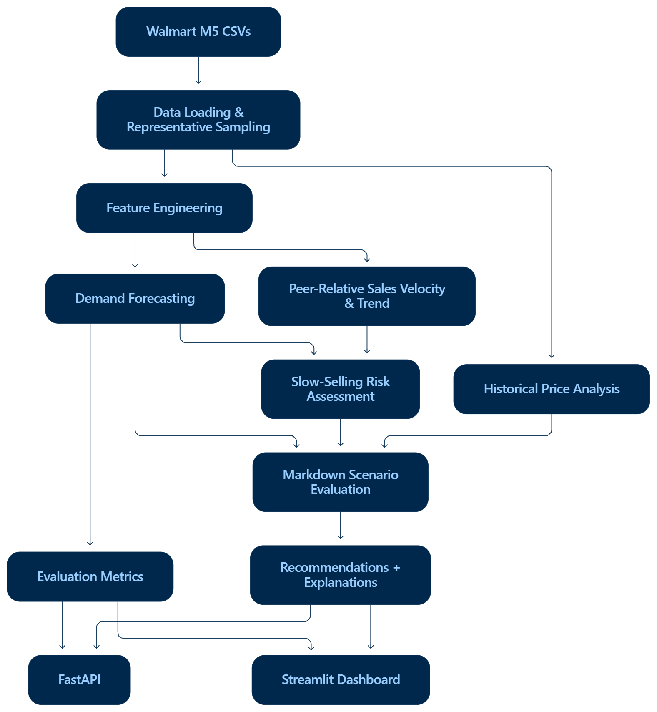

# Slow-Selling SKU Detection & Markdown Recommendation System

An applied machine-learning decision-support prototype that identifies slow-selling SKU-store combinations from historical sales behavior, forecasts near-term demand, and evaluates bounded markdown scenarios. It uses Walmart M5 sales, calendar, and price data, without actual stock-on-hand, procurement cost, margin, or causal promotion/uplift data. Recommendations support human review; they do not establish inventory excess or optimize actual profit.

## Problem

Retail teams need to identify products exhibiting persistently weak sales relative to comparable products and decide whether a conservative markdown scenario deserves review. Sales decline alone is insufficient: a high-volume SKU can decline and still sell well relative to its peers.

## Solution

The offline pipeline loads M5 data, selects representative SKU-store series, builds time-series features, fits a demand model, assesses peer-relative velocity, classifies risk, and evaluates bounded markdown scenarios. FastAPI and Streamlit expose the saved recommendations and explanations without running training on requests.

## Dataset

The demonstrated run uses the Walmart M5 Forecasting - Accuracy dataset:

- Historical daily unit sales and item, category, store, and state identifiers.
- Calendar dates, weekday and month, and an event-presence indicator derived from `event_name_1`.
- State-specific SNAP indicators where available.
- Weekly sell prices joined by item, store, and calendar week.

Stock on hand, inventory age, procurement cost, unit margin, and warehouse capacity are unavailable to this application.

Obtain the official **M5 Forecasting - Accuracy** competition data from Kaggle and place these files in `data/raw/`:

```text
calendar.csv
sales_train_evaluation.csv
sell_prices.csv
```

Raw CSVs are excluded from Git and the Docker build context. See [dataset setup](data/raw/README.md). No dataset download is performed automatically.

## Methodology

### Representative Series Sampling

The demonstrated run selects 500 SKU-store series, not the full M5 dataset. The deterministic sampler retains series with positive sales in the final 56 days, allocates slots across category/store groups, and selects evenly spaced positions after sorting each group by recent unit sales and series ID. Any remaining slots are filled deterministically. This is intended to span different sales-velocity levels, rather than selecting only top sellers.

### Feature Engineering

`src/features.py` supplies these model inputs:

| Features | Definition |
|---|---|
| `lag_7`, `lag_14`, `lag_28` | Sales 7, 14, and 28 days earlier |
| `rolling_mean_7`, `rolling_mean_28` | Mean sales over the preceding 7 or 28 days |
| `rolling_std_28` | Standard deviation of sales over the preceding 28 days |
| `sales_trend_28` | `(recent 14-day mean - prior 14-day mean) / (abs(prior mean) + 1)` |
| `sell_price` | Price forward-filled, then backward-filled within each series |
| `price_change_pct` | Within-series fractional price change |
| `wday`, `month`, `event`, `snap` | Calendar and state-specific indicators |

Lag and rolling demand features are shifted so they exclude the current target. Rows missing required features or sales are dropped. The trend is a normalized change with a stabilizing denominator, not an ordinary percentage change.

### Demand Forecasting

The model is scikit-learn's `HistGradientBoostingRegressor`, with learning rate 0.07, 180 iterations, 31 maximum leaf nodes, L2 regularization 0.1, and random seed 42. Predictions are clipped at zero.

Training uses dates before the final 28 calendar days; validation uses those final 28 days inclusively. The baseline is the preceding seven-day rolling mean, clipped at zero. Evaluation reports MAE, RMSE, WMAPE (sum of absolute errors divided by sum of absolute actual sales), and relative MAE improvement over the baseline.

Validation features use observed earlier sales, including earlier dates within the holdout. This evaluates daily predictions with observed history, not a fixed-origin recursive 28-day forecast. For recommendations, the latest feature row's daily prediction is multiplied by seven to form `forecast_7d`; the implementation does not forecast seven separate future days or refit the model after validation.

### Slow-Selling Risk

Recent 28-day mean sales are percentile-ranked within the sampled category/store peers, with average ranks for ties. Lower percentiles mean slower sales. The score follows these rules:

| Signal | Score contribution |
|---|---|
| Velocity percentile <= 0.15 | +2 |
| Otherwise, velocity percentile <= 0.35 | +1 |
| For percentile <= 0.35, trend <= -0.20 | +2 |
| Otherwise, for percentile <= 0.35, trend <= -0.05 | +1 |
| For percentile <= 0.35, `forecast_7d < max(1.0, 0.75 * rolling_mean_28 * 7)` | +1 |

A score of at least 4 is HIGH, at least 2 is MEDIUM, and below 2 is LOW. Peer-relative velocity is the primary signal; deterioration adds evidence only for already slow series. Decline alone cannot make a high-velocity series HIGH risk.

### Markdown Scenario Evaluation

Scenario elasticity is estimated from seven-day sales sums and mean prices, using the slope of `log1p(sales)` against `log(price)`. At least eight usable weekly observations and three distinct weekly prices are required. A finite negative slope is clipped to [-3.0, -0.2] and labeled `historical_association`; insufficient variation, nonfinite slopes, or nonnegative slopes use a labeled -1.0 fallback. This is observational scenario analysis, not causal elasticity.

| Risk | Candidate markdowns | Maximum with fallback elasticity |
|---|---|---|
| LOW | 0% | 0% |
| MEDIUM | 0%, 5%, 10% | 5% |
| HIGH | 0%, 5%, 10%, 15%, 20% | 10% |

For discount fraction `d` and scenario elasticity `e`, scenario units are `max(0, forecast_7d * (1 - d) ** e)` and scenario revenue is `units * current_price * (1 - d)`. The smallest qualifying positive markdown must meet both guardrails:

- Unit-uplift guardrail: at least 105% of the zero-markdown scenario units.
- Revenue-retention guardrail: at least 95% of the zero-markdown scenario revenue.

Baseline denominators are floored at `1e-9` for comparison. If no candidate qualifies, the recommendation is 0%. Expected units and revenue are scenario outputs, not measured business uplift or profit.

## Results on the Demonstrated M5 Sample

These verified results describe the representative 500-series sample, not all Walmart products.

| Metric | Result |
|---|---:|
| Series | 500 |
| Training rows | 942,500 |
| Validation rows | 14,000 |
| Holdout | 28 days (2016-04-25 through 2016-05-22) |
| Baseline MAE | 1.391 |
| Model MAE | 1.282 |
| RMSE | 3.477 |
| WMAPE | 0.474 |
| MAE improvement | 7.88% |

| Risk | SKU-store series |
|---|---:|
| LOW | 390 |
| MEDIUM | 94 |
| HIGH | 16 |

| Recommended markdown | SKU-store series |
|---|---:|
| 0% | 393 |
| 5% | 104 |
| 10% | 3 |

Full-precision evaluation values are in [metrics.json](artifacts/metrics.json), and individual outputs are in [recommendations.csv](data/processed/recommendations.csv).

## Architecture / Workflow




## Project Structure

```text
slow-moving-inventory/
├── src/                         Offline ML pipeline
│   ├── config.py                Paths and default settings
│   ├── data.py                  Load M5 data and sample SKU-store series
│   ├── features.py              Build lag, rolling-sales, and other features
│   ├── model.py                 Train the model and evaluate predictions
│   ├── recommend.py             Classify risk and evaluate markdown scenarios
│   └── pipeline.py              Run the complete pipeline
│
├── api/
│   └── main.py                  FastAPI endpoints for saved results
│
├── app/
│   └── streamlit_app.py          Interactive dashboard
│
├── data/
│   ├── raw/                     Local M5 CSVs and dataset instructions
│   └── processed/
│       ├── features.csv         Generated training features; Git-ignored
│       └── recommendations.csv  Saved portfolio recommendations
│
├── artifacts/
│   ├── demand_model.joblib      Saved trained model; Git-ignored
│   └── metrics.json             Saved evaluation metrics
│
├── tests/                       Feature, recommendation, and pipeline tests
├── .github/workflows/ci.yml      Runs tests on pushes and pull requests
├── Dockerfile                   Container setup; starts Streamlit by default
├── .dockerignore                Excludes heavy/local files from Docker
├── .gitignore                   Excludes local data, models, and caches from Git
├── requirements.txt             Python dependencies
└── README.md                    Project explanation and setup instructions
```

## Local Run Instructions

Run commands from the repository root. Python 3.12 matches CI and Docker.

```powershell
python -m venv .venv
.\.venv\Scripts\Activate.ps1
pip install -r requirements.txt
```

On Unix-like systems, activate with `source .venv/bin/activate` instead.

The saved portfolio metrics and recommendations are sufficient for serving the demonstrated results. Training is optional: to reproduce the pipeline, place the three Kaggle CSVs in `data/raw/`, then run:

```powershell
python -m src.pipeline --max-series 500
```

This writes training features, a model binary, metrics, and recommendations, replacing existing outputs. The synthetic `--demo` mode writes to the same paths; use a separate copy for smoke experiments to preserve real results. Demo metrics are not portfolio results.

Run tests:

```powershell
pytest -q
```

For an explicit local temporary directory:

```powershell
pytest -q --basetemp=.pytest_tmp
```

Start Streamlit:

```powershell
python -m streamlit run app/streamlit_app.py
```

Open `http://localhost:8501`. No manual `PYTHONPATH` setup is needed. In another activated terminal, start FastAPI:

```powershell
python -m uvicorn api.main:app --reload
```

Interactive API documentation: `http://127.0.0.1:8000/docs`.

## API Documentation

| Endpoint | Behavior |
|---|---|
| `GET /health` | Returns `{"status":"ok"}`; does not check artifact availability |
| `GET /metrics` | Returns saved metrics; HTTP 503 if missing |
| `GET /recommendations` | Returns saved recommendation records; optional case-insensitive `risk` filter and `limit` (default 50, range 1-500) |
| `GET /recommendations/{item_id}/{store_id}` | Returns the matching record, or HTTP 404 if absent |

Recommendation endpoints return HTTP 503 if the recommendations file is missing. An unmatched risk filter returns an empty list. Records include IDs, category, risk and score, velocity percentile, forecast and recent sales, trend, price, scenario elasticity and provenance, markdown, scenario units/revenue, and both explanations.

```powershell
Invoke-RestMethod 'http://127.0.0.1:8000/health'
Invoke-RestMethod 'http://127.0.0.1:8000/metrics'
Invoke-RestMethod 'http://127.0.0.1:8000/recommendations?risk=HIGH&limit=3'
Invoke-RestMethod 'http://127.0.0.1:8000/recommendations/HOBBIES_1_125/TX_3'
```

## Docker

```powershell
docker build -t slow-selling-sku .
docker run --rm -p 8501:8501 slow-selling-sku
```

The default container starts Streamlit on port 8501. To serve FastAPI instead, override the command:

```powershell
docker run --rm -p 8000:8000 slow-selling-sku python -m uvicorn api.main:app --host 0.0.0.0 --port 8000
```

The image includes saved metrics and recommendations. Neither service loads the model binary to serve these outputs; a local model binary is retained in Docker builds when present, but excluded from Git. Raw M5 CSVs and intermediate training features are excluded from the image.

The validated local build packaged approximately 431 KB of project files after cleanup, down from a reported 1.14 GB build context, with an approximately 270 MB image. BuildKit's incremental transfer can be smaller due to caching; sizes vary with dependencies and documentation. Streamlit and the three API checks above passed container validation, and raw M5 CSVs were confirmed absent.


## CI

`.github/workflows/ci.yml` runs on pushes and pull requests. It checks out the repository, installs Python 3.12 on Ubuntu, installs `requirements.txt`, and runs `pytest -q`. Tests use synthetic fixtures and temporary outputs; CI does not download M5 data, train the real pipeline, build Docker, or deploy. The validated local suite has seven passing tests with no model deprecation warnings.

